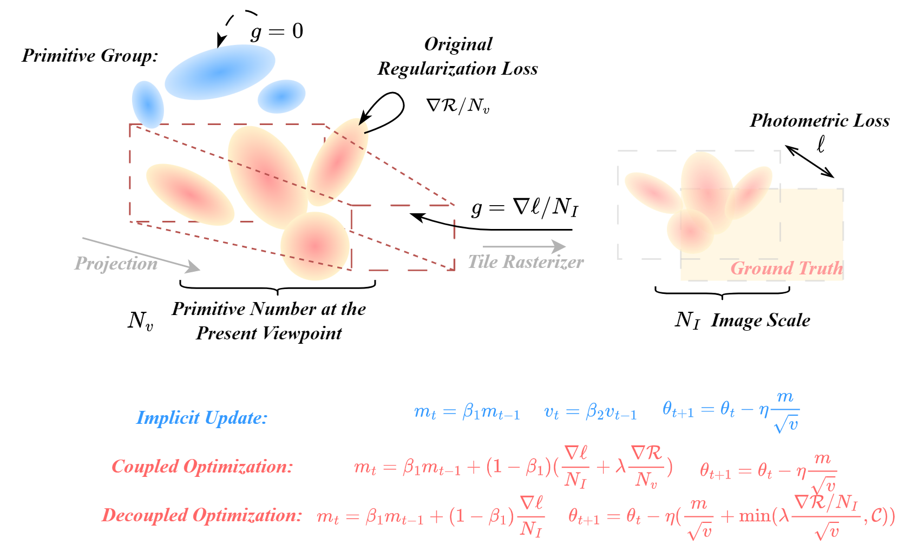

## 3DGS + AdamW-GS
Official repository for the paper "A Step to Decouple Optimization in 3DGS"

> **A Step to Decouple Optimization in 3DGS**  
> Renjie Ding, Yaonan Wang, Min Liu, Jialin Zhu, Jiazheng Wang, Jiahao Zhao, Wenting Shen, Feixiang He, Xiang Chen
> 
> *ICLR 2026*  
> [Project](https://eliottdjay.github.io/adamwgs/)
| [arxiv](https://arxiv.org/abs/2601.16736)

## AdamWGS
**Motivation:**
- _Update-step coupling in Adam_ implicitly rescales the optimizer state, causing updates even on currently invisible primitives.
- _Gradient coupling in Adam_ may lead to under- or over-regularization.

**Contribution:**
- Decouple Adam in 3DGS optimization and recompose it into three effective components: Sparse Adam, Re-State Regularization, and Decoupled Attribute Regularization.
- Conduct exploratory experiments for different components.
- Propose AdamW-GS, which enables more controllable attribute regularization, and apply it to vanilla 3DGS, 3DGS-MCMC, and additional variants, including MaskGaussian, Taming3DGS, and Deformable Beta Splatting (reported in the Appendix).

<p align="center">
  <br>
  <em>Figure 1: Coupled Optimization vs. Decoupled Optimization.</em>
</p>


## ToDo List

- [ ] Release replacement files for Taming-3DGS with direct AdamW-GS support.

## Tutorial
.

## Acknowledgements
This project is built upon [3DGS](https://github.com/graphdeco-inria/gaussian-splatting), [3DGSMCMC](https://github.com/ubc-vision/3dgs-mcmc), [Taming-3DGS](https://humansensinglab.github.io/taming-3dgs/) and [RAIN-GS](https://github.com/cvlab-kaist/RAIN-GS). Please follow the license of 3DGS and the referenced repositories. We gratefully acknowledge all authors for their valuable contributions and open-source releases.

## Citation

If you find this project useful, please consider citing:

```bibtex
@inproceedings{
ding2026a,
title={A Step to Decouple Optimization in 3{DGS}},
author={Renjie Ding and Yaonan Wang and Min Liu and Jialin Zhu and Jiazheng Wang and Jiahao Zhao and Wenting Shen and Feixiang He and Xiang Chen},
booktitle={The Fourteenth International Conference on Learning Representations},
year={2026},
url={https://openreview.net/forum?id=oapTMDy2Yh}
}

@article{ding2026step,
  title={A Step to Decouple Optimization in 3DGS},
  author={Ding, Renjie and Wang, Yaonan and Liu, Min and Zhu, Jialin and Wang, Jiazheng and Zhao, Jiahao and Shen, Wenting and He, Feixiang and Che, Xiang},
  journal={arXiv preprint arXiv:2601.16736},
  year={2026}
}
```
