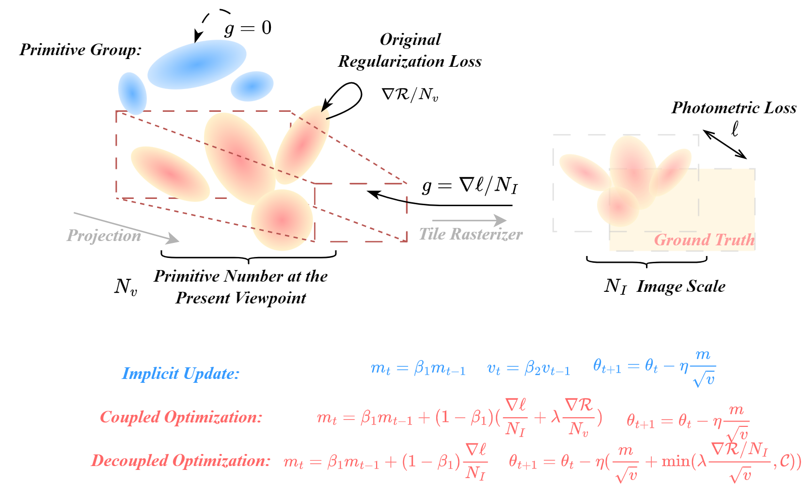

## 3DGS + AdamW-GS
Official repository for the paper "A Step to Decouple Optimization in 3DGS"

> **A Step to Decouple Optimization in 3DGS**  
> Renjie Ding, Yaonan Wang, Min Liu, Jialin Zhu, Jiazheng Wang, Jiahao Zhao, Wenting Shen, Feixiang He, Xiang Chen
> 
> *ICLR 2026*  
> [Project](https://eliottdjay.github.io/adamwgs/)
| [arxiv](https://arxiv.org/abs/2601.16736)

## AdamWGS
**Motivation:**
- _Update-step coupling in Adam_ implicitly rescales the optimizer state, causing updates even on currently invisible primitives.
- _Gradient coupling in Adam_ may lead to under- or over-regularization.

**Contribution:**
- Decouple Adam in 3DGS optimization and recompose it into three effective components: Sparse Adam, Re-State Regularization, and Decoupled Attribute Regularization.
- Conduct exploratory experiments for different components.
- Propose AdamW-GS, which enables more controllable attribute regularization, and apply it to vanilla 3DGS, 3DGS-MCMC, and additional variants, including MaskGaussian, Taming3DGS, and Deformable Beta Splatting (reported in the Appendix).

<p align="center">
  <br>
  <em>Figure 1: Coupled Optimization vs. Decoupled Optimization.</em>
</p>

## Tutorial

We provide a separate configuration folder for each scene. To run an experiment, simply execute:

```bash
sh execute.sh -c <cuda> -s <seed>
```

where `<cuda>` specifies the GPU device and `<seed>` specifies the random seed.

The `config.yaml` file is provided for convenient modification of experimental settings. More implementation details are similar to [3DGS](https://github.com/graphdeco-inria/gaussian-splatting).

We also provide code files that can be used to replace the corresponding components in Taming-3DGS. After replacement, run:

```
python $ROOT/train.py -s ./dataset/Render/bicycle -i images_4 -m ./  --benchmark_dir ./time --quiet --eval \
    --test_iterations -1  --optimizer_type sparse_ours --budget 5987095  --densification_interval 100 --mode final_count \
    --opacity_reset_interval 3000000 \
    --opacity_penalty_begin 3000 --opacity_penalty_end 14000 --scaling_penalty_begin 1000 --scaling_penalty_end 14000 \
    --rer_exp_avg_inherit --rer_exeavg_fading 0.2 --rer_exp_avgsq_inherit --rer_exeavgsq_fading 0.04 \
    --use_er --er_begin 1000 --er_end 14000 --er_strategy uni_curriculum --ratial_list "0.1,0.3" --ratio_shift "1000,7000" \
    2>&1 | tee ./3dgs_$now.txt


python $ROOT/render.py -m ./

python $ROOT/metrics.py -m ./
```

## Notes

* In the experiments reported in the paper, the default setting uses $N_I/10$. Therefore, all corresponding $\lambda$ values are also scaled by a factor of $1/10$. In the current configuration, we use $N_I$ directly, so the corresponding $\lambda$ values are scaled up by a factor of 10. Please refer to the `experiments` folder for more details. Taming-GS still follows the $N_I/10$ setting.
* When the number of $N_p$ is small, more conservative restart parameters are preferred, such as `0.1` and `1000`, which are used in several scenes of Taming-GS.
* When $N_p$ is much larger than $N_a$, the MCMC-based framework may lead to degraded reconstruction quality.
* We tested different configurations of $\mathcal{C}$ in Eq. 8, including $\{1, 5, 10, 20\}$. The overall differences were minor. Continuing to apply regularization after densification ends brings limited additional benefit.


## Acknowledgements
This project is built upon [3DGS](https://github.com/graphdeco-inria/gaussian-splatting), [3DGSMCMC](https://github.com/ubc-vision/3dgs-mcmc), [Taming-3DGS](https://humansensinglab.github.io/taming-3dgs/) and [RAIN-GS](https://github.com/cvlab-kaist/RAIN-GS). Please follow the license of 3DGS and the referenced repositories. We gratefully acknowledge all authors for their valuable contributions and open-source releases.

## Citation

If you find this project useful, please consider citing:

```bibtex
@inproceedings{
ding2026a,
title={A Step to Decouple Optimization in 3{DGS}},
author={Ding, Renjie and Wang, Yaonan and Liu, Min and Zhu, Jialin and Wang, Jiazheng and Zhao, Jiahao and Shen, Wenting and He, Feixiang and Che, Xiang},
booktitle={The Fourteenth International Conference on Learning Representations},
year={2026},
url={https://openreview.net/forum?id=oapTMDy2Yh}
}

@article{ding2026step,
  title={A Step to Decouple Optimization in 3DGS},
  author={Ding, Renjie and Wang, Yaonan and Liu, Min and Zhu, Jialin and Wang, Jiazheng and Zhao, Jiahao and Shen, Wenting and He, Feixiang and Che, Xiang},
  journal={arXiv preprint arXiv:2601.16736},
  year={2026}
}
```
